# Análisis Exploratorio y Temporal de la Producción de Pozos Petroleros en Argentina

Este análisis explora los datos desde el 2020 de la producción de pozos petroleros en Argentina. Los datos utilizados se encuentran en esta [carpeta de Google Drive](https://drive.google.com/drive/folders/1lgD0gZq76QFelkK3sJDb-n46Ntgx532O?usp=sharing) ya que la página original de [datos.gob.ar](https://datos.gob.ar/dataset) no siempre está disponible.

En el análisis exploratorio, me enfoco solo en los datos de marzo de 2024, mientras que en el análisis temporal uso datos desde enero de 2020 a marzo de 2024.
Para la versión en inglés de este documento, consulte [aquí](README_en.md).

## Análisis Exploratorio

En este análisis, me familiarizo con el dataset, eliminando elementos irrelevantes para el objetivo del estudio.

### Preguntas del Análisis Exploratorio

1. **¿Cuántos pozos hay por provincia?**
   
   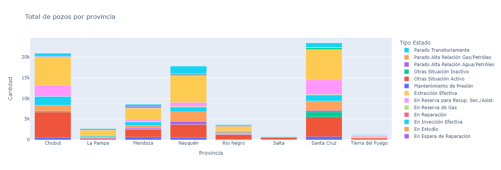

2. **¿Cuál es el porcentaje de pozos no abandonados por provincia?**

   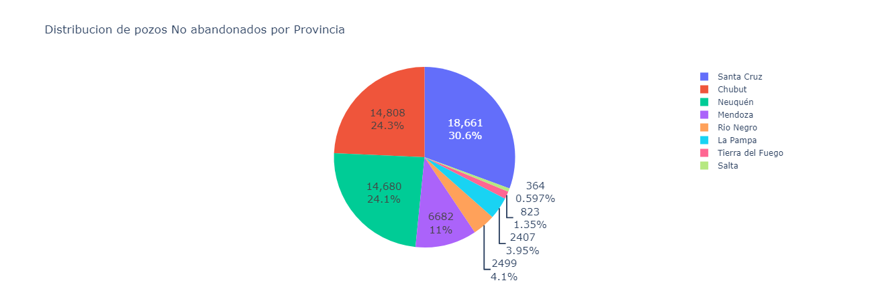

3. **¿Cuántos pozos activos hay por provincia?**

   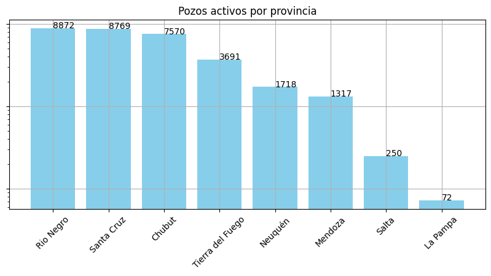

4. **¿Cuál es la producción por provincia?**

   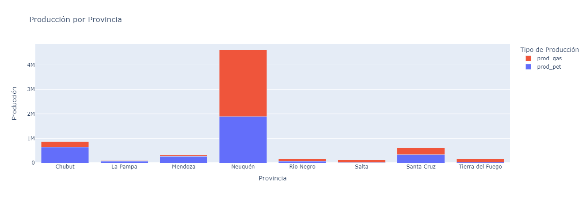

5. **¿Qué empresa tiene la mayor producción?**

   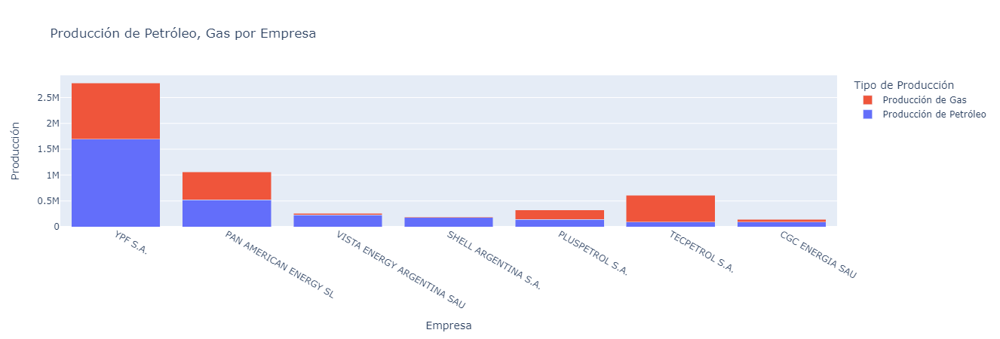

6. **¿Qué cuenca produce más?**

   

7. **¿Cuál es el tipo de extracción más frecuente?**

   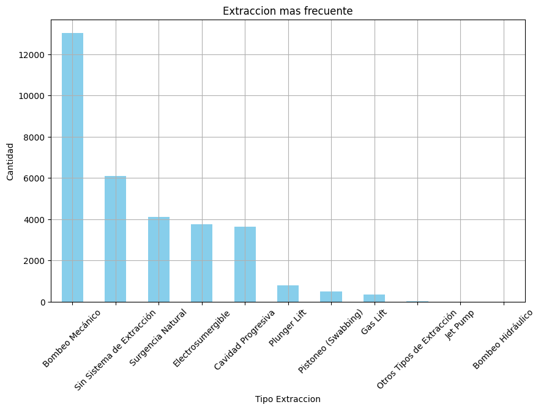

---

## Análisis Temporal

### Preguntas del Análisis Temporal

1. **¿Cómo es la evolución trimestral?**

   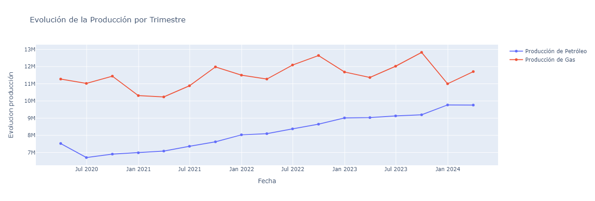
   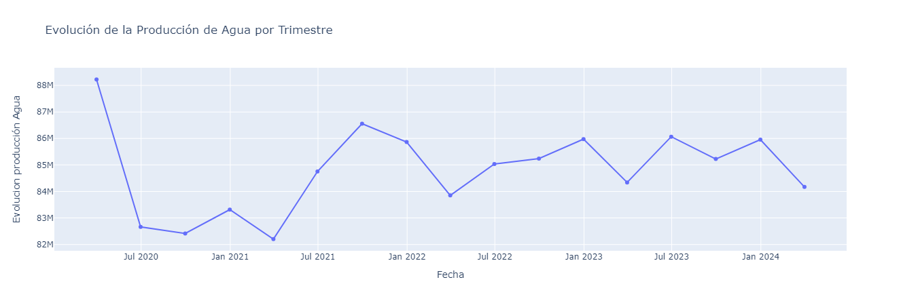

2. **¿Cómo es la evolución mensual?**

   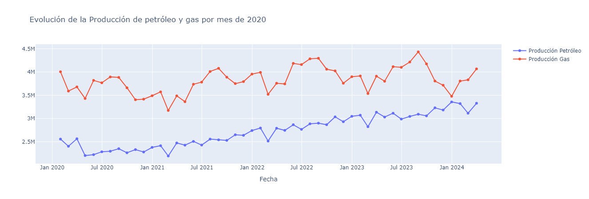
   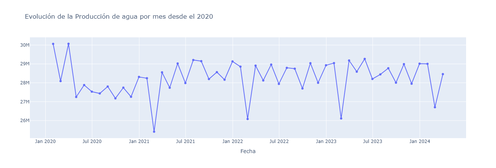

3. **Producción por las top 5 empresas**

   **Producción de Petróleo, Gas y Agua**
   
   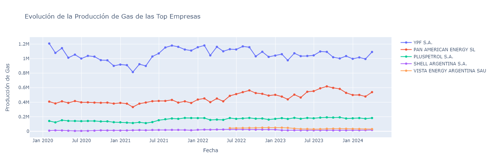
   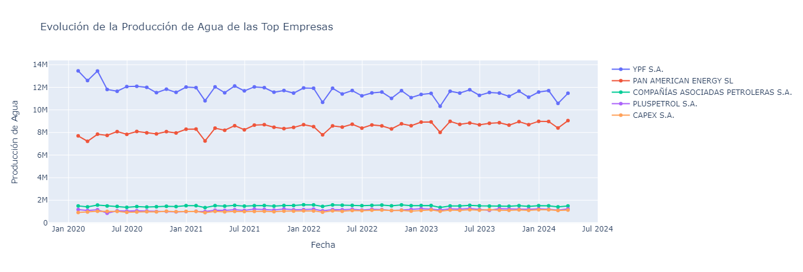

4. **Producción por Cuenca**

   **Producción de Petróleo, Gas y Agua**
   
   
   

Para la versión en inglés de este documento, consulte [aquí](README_en.md).
