# Exploratory and Temporal Analysis of Oil Well Production in Argentina

This analysis explores data from 2020 on oil well production in Argentina. The data used can be found in this [Google Drive folder](https://drive.google.com/drive/folders/1lgD0gZq76QFelkK3sJDb-n46Ntgx532O?usp=sharing) as the original page from [datos.gob.ar](https://datos.gob.ar/dataset) is not always available.

In the exploratory analysis, I focus only on data from March 2024, while in the temporal analysis I use data from January 2020 to March 2024.
For the Spanish version of this document, please see [here](README.md).

## Exploratory Analysis

In this analysis, I familiarize myself with the dataset, removing irrelevant elements for the study's objective.

### Exploratory Analysis Questions

1. **How many wells are there per province?**
   
   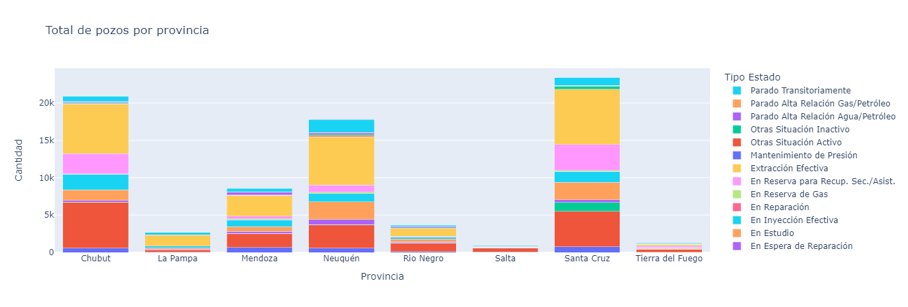

2. **What is the percentage of non-abandoned wells per province?**

   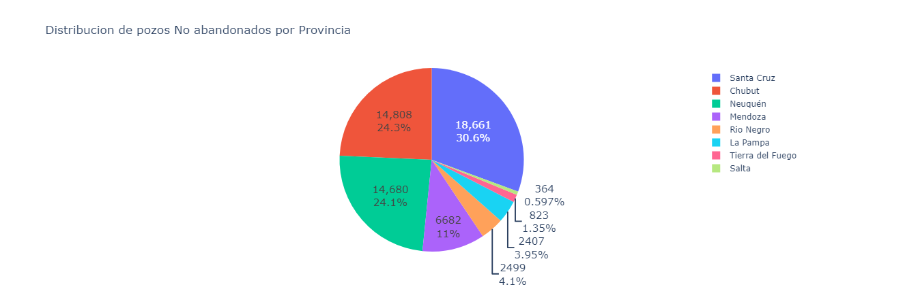

3. **How many active wells are there per province?**

   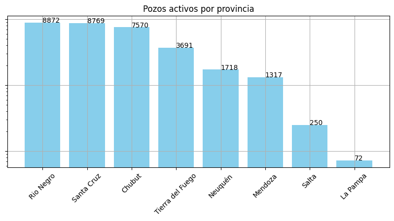

4. **What is the production per province?**

   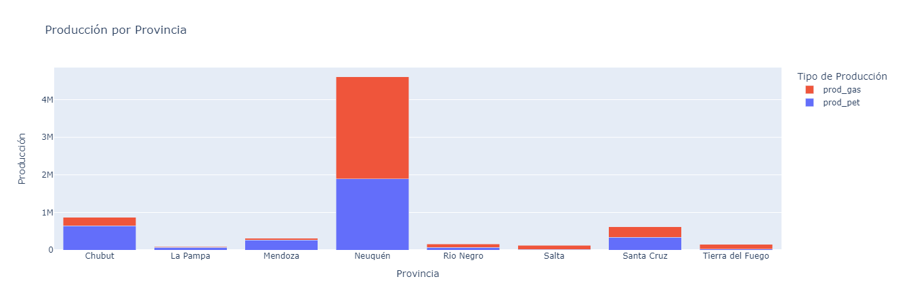

5. **Which company has the highest production?**

   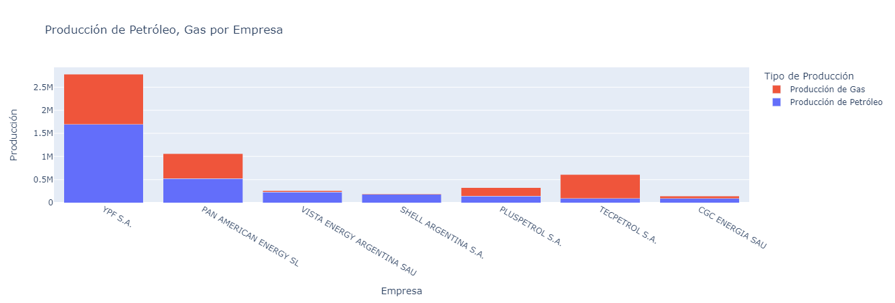

6. **Which basin produces the most?**

   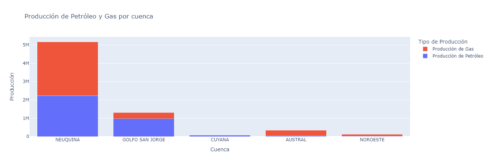

7. **What is the most frequent type of extraction?**

   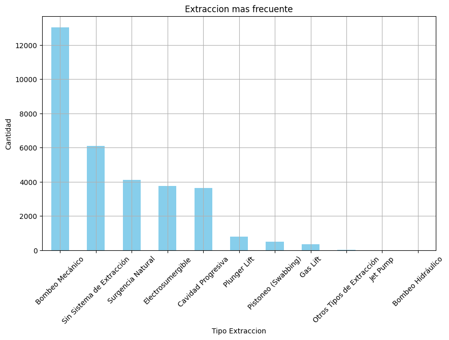

---

## Temporal Analysis

### Temporal Analysis Questions

1. **What is the quarterly evolution?**

   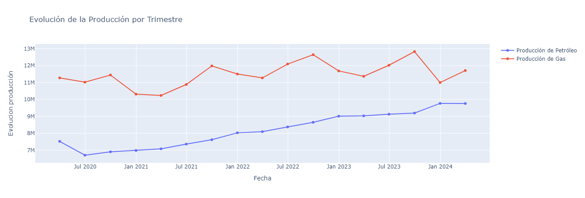
   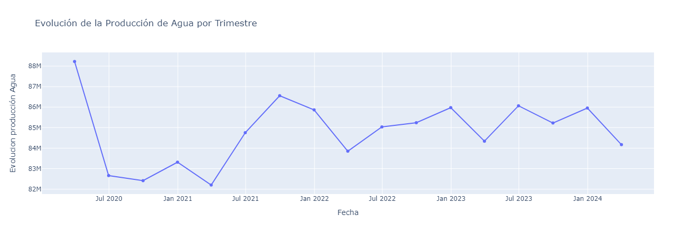

2. **What is the monthly evolution?**

   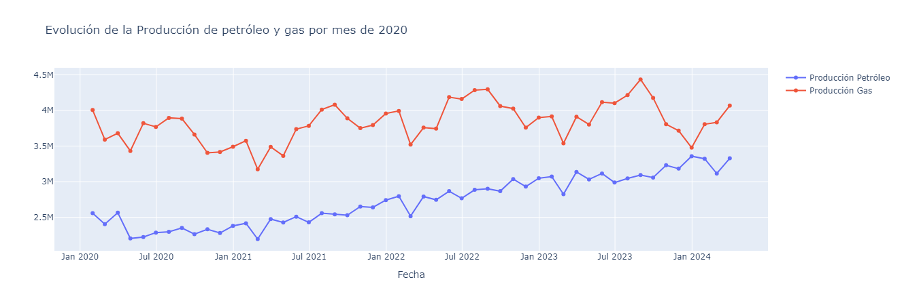
   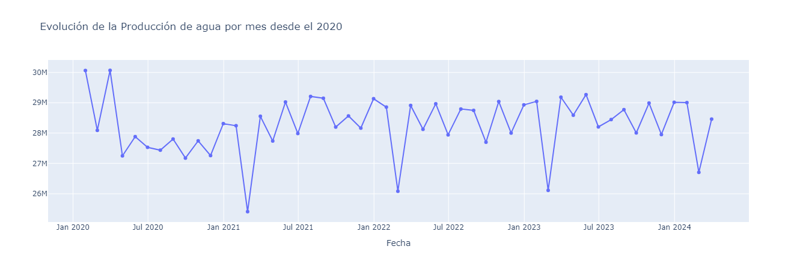

3. **Production by the top 5 companies**

   **Production of Oil, Gas, and Water**
   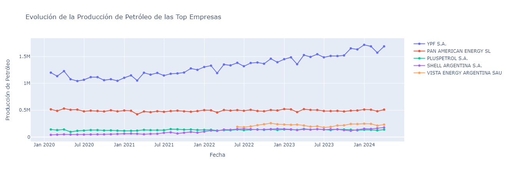
   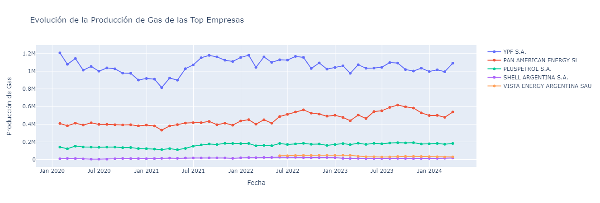
   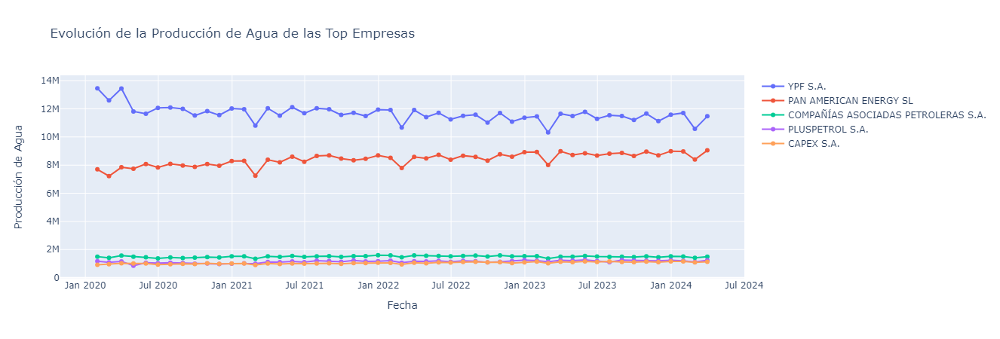

4. **Production by Basin**

   **Production of Oil, Gas, and Water**
   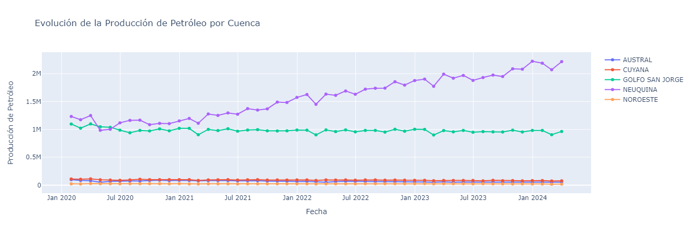
   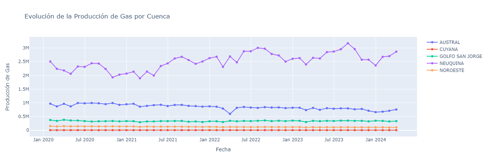
   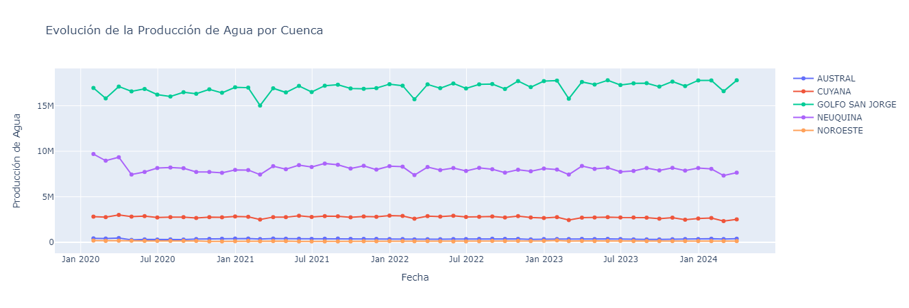

For the Spanish version of this document, please see [here](README.md).
